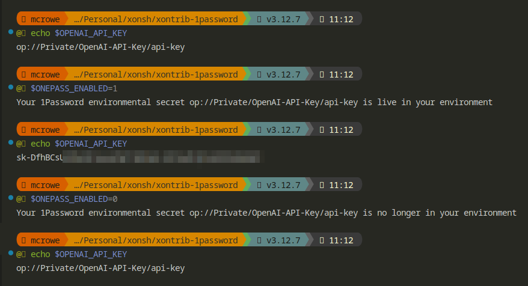

<p align="center">
<a href="https://1password.com/">1password</a> support for xonsh shell. This approach ensures your sensitive information remains secure while being easily accessible in your xonsh shell.
</p>

<p align="center">
If you like the idea click ⭐ on the repo and <a href="https://twitter.com/intent/tweet?text=Nice%20xontrib%20for%20the%20xonsh%20shell!&url=https://github.com/drmikecrowe/xontrib-1password" target="_blank">tweet</a>.
</p>

## Installation

To install use pip:

```xsh
xpip install xontrib-1password
# or: xpip install -U git+https://github.com/drmikecrowe/xontrib-1password
```

The xontrib will get loaded automatically.

## Usage

Store your passwords in [1Password](https://1password.com/) and setup [`op` CLI](https://developer.1password.com/docs/cli/) locally.
Then:
```xsh
$XONTRIB_ONEPASS_ENABLED = True
$MYKEY = OnePass("op://path/my/key")
$MYKEY
# My key value.

$XONTRIB_ONEPASS_ENABLED = False
$MYKEY
# op://path/my/key
```

## Examples



## Good to know

### Disable autoloading

```xsh
$XONTRIBS_AUTOLOAD_DISABLED = ["1password", ]
# if you have set this for other xontribs, you should append the value
```

### Get certain key

Because of the URL is basically `op://<Vault>/<title>/<field>` to find this, here's the commands you can use to determine these fields:

```sh
op item list --format json | jq '.[].title | select(. | contains("OpenAI"))' 
# "OpenAI-API-Key"
op item get OpenAI-API-Key --format json | jq '.fields[] | select(.type == "CONCEALED") | .label'
# "api-key"
```

## Known issues

### Alpha version

This is the initial release of the xontrib. Issues and pull requests are welcome.

## Development

- activate [pre-commit](https://github.com/pre-commit/pre-commit) hooks
```sh
# install pre-commit plugins and activate the commit hook
pre-commit install
pre-commit autoupdate
```

### Releasing your package

- Bump the version of your package.
- Create a GitHub release (The release notes are automatically generated as a draft release after each push).
- And publish with `poetry publish --build` or `twine`

## Credits

This package was created with [xontrib template](https://github.com/xonsh/xontrib-template).

